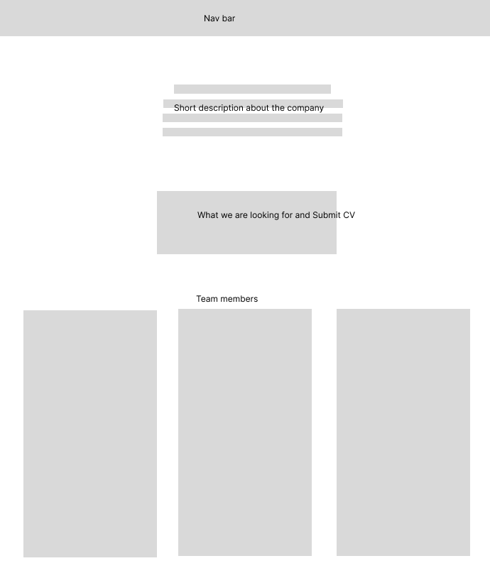

# Unit 15

## Assignment 2

## File Structure

├───Application form
├───assets
│   ├───css
│   └───images     
│       ├───Readme 
│       └───Website
├───doc
├───git
└───src

## Tasks to do

## Requirements
 
### Client Requirements
 
+ Have a company profile
+ Have profiles of existing trainee web developers
+ Job specifications and required qualifications
+ An online application form
+ Have links to web development courses
 
### User Requirements
 
+ A website that is accessible
+ A website that is easy to use and understand
+ A website that is easy to navigate
+ A website that is responsive
+ A website that loads within a couple seconds
 
### Developer requirements
 
+ Code needs to be easy to understand
+ Code needs to be easy to maintain
+ Code needs to  have comments explaining functionality

## Storyboard

Profiles of existing trainee web developers

